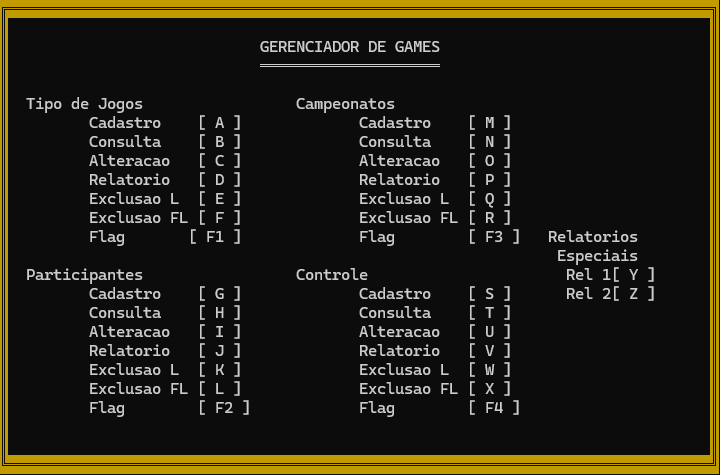

# GerenciadorCampeonatos

Projeto desenvolvido durante o segundo semestre da minha graduação em Sistemas de Informação.

Desenvolvido em C++, o projeto teve como objetivo explorar e fixar alguns conceitos importantes:

- **Modularização do algoritmo**: Hoje, após alguns anos de estudo, consigo identificar inúmeros pontos do código que poderiam ser melhorados. Isso é algo natural com a experiência. No entanto, na época, desenvolver esse programa foi crucial para entender na prática a importância da modularização.

- **Arquivo Binário**: Utilizei arquivos binários para gravar os registros, simulando um banco de dados local.

- **Lógica de Programação**: Todo projeto influencia diretamente no desenvolvimento da lógica de programação. Resolver problemas da melhor forma possível e reconhecer oportunidades de melhoria são habilidades fundamentais que foram trabalhadas nesse projeto.

- **Biblioteca CONIO2**: Utilizei a biblioteca CONIO2 para o desenvolvimento visual do sistema. Foi muito interessante trabalhar pixel por pixel e desenvolver as telas para cada etapa do algoritmo.

Em geral, este foi um dos primeiros algoritmos funcionais que desenvolvi na faculdade. Lembro até hoje das horas e horas na frente do computador, enfrentando desafios e pensando: "POR QUE DIABOS ISSO NÃO ESTÁ FUNCIONANDO?!". 
#NoPainNoGain

---

### **Como rodar:**
1. Siga as instruções do repositório a seguir [Tutorial IDE](https://github.com/mateus-sm/Conio2-VsCode) para utilizar o VSCODE como IDE C / C++ (Copilar o arquivo). Tal repositório ja inclui a biblioteca do CONIO2 que é utilizada no projeto, caso opte por outra IDE de C / C++, certifique-se de incluí-la.
2. Adicione os arquivos binários fornecidos no mesmo repositório do programa.
3. execute o programa `GerenciadorCampeonatos.cpp`.

Alguns registros já estão disponíveis nos arquivos binários fornecidos. No entanto, caso deseje começar com o "banco de dados" vazio, basta esvaziar os arquivos binários manualmente.

---

